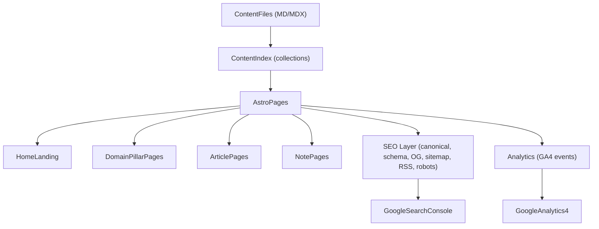

# Learning Hub Website Implementation Plan

> **For agentic workers:** REQUIRED SUB-SKILL: Use superpowers:subagent-driven-development (recommended) or superpowers:executing-plans to implement this plan task-by-task. Steps use checkbox (`- [ ]`) syntax for tracking.

**Goal:** Build an SEO-first, bilingual (VI/EN) Learning Hub website (landing + domain pillars + Articles + Notes) with GA4 + GSC tracking, using Astro + Markdown/MDX.

**Architecture:** Astro renders static pages from a file-based content layer (Markdown/MDX). The site is organized into domain pillars (AI/Backend/Kafka/Banking/…), with Articles as canonical SEO drivers and Notes as learning-first capture (indexable only when quality threshold is met). Bilingual content is implemented as language-prefixed routes with `hreflang` between VI/EN variants.

**Tech Stack:** Astro, Markdown/MDX, TypeScript, sitemap + RSS generation, GA4, Google Search Console.

---

## Assumptions (explicit defaults)

- Bilingual model: **two files per post** (one VI, one EN) with a shared `translationKey` to connect them.
- Content types shipped in MVP: **Articles + Notes** (KB pages deferred; can be added later without breaking structure).
- Deploy target: **Vercel** (can switch later; Astro is portable).
- Newsletter: deferred (we’ll still implement `newsletter_subscribe` event wiring placeholder in UI to avoid rework later).

## System Diagram (high-level)



## File structure (locked-in decomposition)

**Create (MVP skeleton):**

- `package.json`
- `astro.config.mjs`
- `tsconfig.json`
- `public/robots.txt`
- `public/favicon.svg`
- `src/site.config.ts` (site name, base URL, social links, GA id, languages)
- `src/content/config.ts` (Astro content collections + Zod schemas)
- `src/content/pillars/<pillar>.md` (domain pillars, bilingual as needed)
- `src/content/articles/<lang>/<slug>.mdx` (Articles)
- `src/content/notes/<lang>/<slug>.mdx` (Notes)
- `src/layouts/BaseLayout.astro`
- `src/layouts/PostLayout.astro`
- `src/pages/index.astro` (Home)
- `src/pages/[lang]/index.astro` (localized home)
- `src/pages/[lang]/pillars/[pillar].astro`
- `src/pages/[lang]/articles/[...slug].astro`
- `src/pages/[lang]/notes/[...slug].astro`
- `src/pages/rss.xml.ts`
- `src/pages/sitemap.xml.ts`
- `src/components/Header.astro`
- `src/components/Footer.astro`
- `src/components/LanguageSwitch.astro`
- `src/components/OutboundLink.astro` (tracks `outbound_click`)
- `src/lib/analytics.ts` (GA4 event helpers)
- `src/styles/global.css`

**Modify (later):**

- `decisions.md` (append decisions as we go)
- `content-architecture.md` (only when IA changes)

## Content model (frontmatter schema)

### Shared fields (all post types)

```ts
// Used in `src/content/config.ts` as Zod schema guidance.
type SharedFrontmatter = {
  title: string;
  description: string;
  lang: "vi" | "en";
  translationKey: string; // stable key across languages, e.g. "career-ops-architecture"
  publishedAt: string; // ISO date
  updatedAt?: string; // ISO date
  draft?: boolean;
  tags?: string[];
  pillar: "ai" | "backend" | "kafka" | "banking" | "other";
  canonicalUrl?: string; // optional override
};
```

### Article-only fields

```ts
type ArticleFrontmatter = SharedFrontmatter & {
  type: "article";
  readingTimeMinutes?: number;
};
```

### Note-only fields

```ts
type NoteFrontmatter = SharedFrontmatter & {
  type: "note";
  // Quality gate: if false/omitted, default noindex until promoted.
  indexable?: boolean;
};
```

## SEO requirements (MVP)

- Canonical URL per page (include language prefix).
- `hreflang` between VI/EN versions of the same `translationKey`.
- JSON-LD schema:
  - `BlogPosting` for Articles/Notes
  - `BreadcrumbList` for pillar → post
  - `Person` or `Organization` at site level
- OpenGraph + Twitter cards.
- `robots.txt` includes sitemap.
- `sitemap.xml` includes only indexable pages:
  - Always include Articles
  - Include Notes only when `indexable: true` and not `draft`

## Analytics requirements (GA4 + GSC)

### GA4: baseline

- Page views (automatic)
- Custom events:
  - `outbound_click` (required)
  - `newsletter_subscribe` (optional UI now; event spec now)
  - `site_search` (if search added later)

Example event payload (minimal):

```ts
type OutboundClickEvent = {
  event: "outbound_click";
  url: string;
  text?: string;
  location?: "header" | "footer" | "post" | "pillar" | "home";
};
```

### GSC: baseline

- Add domain/property after deploy
- Submit sitemap URL

---

### Task 1: Initialize Astro project skeleton

**Files:**
- Create: `package.json`, `astro.config.mjs`, `tsconfig.json`

- [ ] **Step 1: Initialize Astro**

Run:

```bash
npm create astro@latest
```

Pick:
- TypeScript: Yes (strict)
- Template: Minimal (or Blog if available; minimal is fine)

- [ ] **Step 2: Install MDX**

Run:

```bash
npm i @astrojs/mdx
```

- [ ] **Step 3: Configure MDX integration**

In `astro.config.mjs` include:

```js
import { defineConfig } from "astro/config";
import mdx from "@astrojs/mdx";

export default defineConfig({
  integrations: [mdx()],
});
```

- [ ] **Step 4: Run dev server**

Run:

```bash
npm run dev
```

Expected: local dev server starts, home page loads.

- [ ] **Step 5: Commit**

```bash
git add .
git commit -m "chore: initialize Astro site"
```

---

### Task 2: Add site config + language routing contract

**Files:**
- Create: `src/site.config.ts`
- Create: `src/pages/[lang]/index.astro`
- Modify: `src/pages/index.astro`

- [ ] **Step 1: Add site config**

Create `src/site.config.ts`:

```ts
export const siteConfig = {
  name: "Learning Hub",
  description:
    "Bilingual (VI/EN) notes and deep dives on AI tools, backend engineering, Kafka, and banking systems.",
  baseUrl: "https://example.com",
  languages: ["vi", "en"] as const,
  defaultLang: "vi" as const,
  social: {
    github: "https://github.com/your-handle",
  },
  analytics: {
    ga4MeasurementId: "G-XXXXXXXXXX",
  },
};
```

- [ ] **Step 2: Implement language home**

Create `src/pages/[lang]/index.astro`:

```astro
---
import { siteConfig } from "../../site.config";
const { lang } = Astro.params;
if (!siteConfig.languages.includes(lang as any)) {
  return Astro.redirect(`/${siteConfig.defaultLang}/`);
}
---
<html lang={lang}>
  <head>
    <title>{siteConfig.name}</title>
    <meta name="description" content={siteConfig.description} />
  </head>
  <body>
    <main>
      <h1>{siteConfig.name}</h1>
      <p>Language: {lang}</p>
    </main>
  </body>
</html>
```

- [ ] **Step 3: Redirect root to default language**

Modify `src/pages/index.astro`:

```astro
---
import { siteConfig } from "../site.config";
return Astro.redirect(`/${siteConfig.defaultLang}/`);
---
```

- [ ] **Step 4: Run**

Run:

```bash
npm run dev
```

Expected:
- `/` redirects to `/vi/`
- `/en/` works

- [ ] **Step 5: Commit**

```bash
git add src/site.config.ts src/pages/index.astro src/pages/[lang]/index.astro
git commit -m "feat: add bilingual routing skeleton"
```

---

### Task 3: Define content collections + schemas (Articles + Notes + Pillars)

**Files:**
- Create: `src/content/config.ts`
- Create: `src/content/pillars/ai.md` (seed)
- Create: `src/content/articles/vi/hello-article.mdx` (seed)
- Create: `src/content/articles/en/hello-article.mdx` (seed)
- Create: `src/content/notes/vi/hello-note.mdx` (seed)
- Create: `src/content/notes/en/hello-note.mdx` (seed)

- [ ] **Step 1: Add Astro content config**

Create `src/content/config.ts`:

```ts
import { defineCollection, z } from "astro:content";

const lang = z.enum(["vi", "en"]);
const pillar = z.enum(["ai", "backend", "kafka", "banking", "other"]);

const shared = z.object({
  title: z.string(),
  description: z.string(),
  lang,
  translationKey: z.string(),
  publishedAt: z.string(),
  updatedAt: z.string().optional(),
  draft: z.boolean().optional(),
  tags: z.array(z.string()).optional(),
  pillar,
  canonicalUrl: z.string().url().optional(),
});

const articles = defineCollection({
  type: "content",
  schema: shared.extend({
    type: z.literal("article"),
    readingTimeMinutes: z.number().int().positive().optional(),
  }),
});

const notes = defineCollection({
  type: "content",
  schema: shared.extend({
    type: z.literal("note"),
    indexable: z.boolean().optional(),
  }),
});

const pillars = defineCollection({
  type: "content",
  schema: z.object({
    title: z.string(),
    description: z.string(),
    pillar,
    lang,
  }),
});

export const collections = { articles, notes, pillars };
```

- [ ] **Step 2: Seed content files**

Create `src/content/pillars/ai.md`:

```md
---
title: "AI"
description: "Tools, workflows, and deep dives."
pillar: "ai"
lang: "en"
---

This pillar collects AI tool reviews, workflows, and architecture deep dives.
```

Create `src/content/articles/vi/hello-article.mdx`:

```mdx
---
type: "article"
title: "Bài viết đầu tiên"
description: "Seed article to validate the pipeline."
lang: "vi"
translationKey: "hello-article"
publishedAt: "2026-04-18"
pillar: "backend"
tags: ["seed"]
---

Xin chào! Đây là bài viết seed.
```

Create `src/content/articles/en/hello-article.mdx`:

```mdx
---
type: "article"
title: "First article"
description: "Seed article to validate the pipeline."
lang: "en"
translationKey: "hello-article"
publishedAt: "2026-04-18"
pillar: "backend"
tags: ["seed"]
---

Hello! This is a seed article.
```

Create `src/content/notes/vi/hello-note.mdx`:

```mdx
---
type: "note"
title: "Ghi chú đầu tiên"
description: "Seed note to validate Notes routing."
lang: "vi"
translationKey: "hello-note"
publishedAt: "2026-04-18"
pillar: "ai"
indexable: false
tags: ["seed"]
---

## Context

I am testing the Notes content pipeline.
```

Create `src/content/notes/en/hello-note.mdx`:

```mdx
---
type: "note"
title: "First note"
description: "Seed note to validate Notes routing."
lang: "en"
translationKey: "hello-note"
publishedAt: "2026-04-18"
pillar: "ai"
indexable: false
tags: ["seed"]
---

## Context

I am testing the Notes content pipeline.
```

- [ ] **Step 3: Run**

Run:

```bash
npm run dev
```

Expected: no content schema errors.

- [ ] **Step 4: Commit**

```bash
git add src/content
git commit -m "feat: add content collections for pillars, articles, and notes"
```

---

### Task 4: Implement pages for Pillars, Articles, Notes (with language routing)

**Files:**
- Create: `src/pages/[lang]/pillars/[pillar].astro`
- Create: `src/pages/[lang]/articles/[...slug].astro`
- Create: `src/pages/[lang]/notes/[...slug].astro`

- [ ] **Step 1: Pillar page**

Create `src/pages/[lang]/pillars/[pillar].astro`:

```astro
---
import { getCollection } from "astro:content";
import { siteConfig } from "../../../site.config";

const { lang, pillar } = Astro.params;
if (!siteConfig.languages.includes(lang as any)) {
  return Astro.redirect(`/${siteConfig.defaultLang}/`);
}

const pillars = await getCollection("pillars", (p) => p.data.lang === lang && p.data.pillar === pillar);
const pillarDoc = pillars[0];
---
<html lang={lang}>
  <head>
    <title>{pillarDoc?.data.title ?? pillar}</title>
    <meta name="description" content={pillarDoc?.data.description ?? ""} />
  </head>
  <body>
    <main>
      <h1>{pillarDoc?.data.title ?? pillar}</h1>
      {pillarDoc ? <p>{pillarDoc.data.description}</p> : <p>Missing pillar content.</p>}
    </main>
  </body>
</html>
```

- [ ] **Step 2: Article page**

Create `src/pages/[lang]/articles/[...slug].astro`:

```astro
---
import { getCollection } from "astro:content";
import { siteConfig } from "../../../site.config";

const { lang, slug } = Astro.params;
if (!siteConfig.languages.includes(lang as any)) {
  return Astro.redirect(`/${siteConfig.defaultLang}/`);
}

const articles = await getCollection("articles", (a) => a.data.lang === lang);
const entry = articles.find((a) => a.slug === slug);
if (!entry) return new Response("Not found", { status: 404 });

const { Content } = await entry.render();
---
<html lang={lang}>
  <head>
    <title>{entry.data.title}</title>
    <meta name="description" content={entry.data.description} />
  </head>
  <body>
    <main>
      <article>
        <h1>{entry.data.title}</h1>
        <Content />
      </article>
    </main>
  </body>
</html>
```

- [ ] **Step 3: Note page**

Create `src/pages/[lang]/notes/[...slug].astro`:

```astro
---
import { getCollection } from "astro:content";
import { siteConfig } from "../../../site.config";

const { lang, slug } = Astro.params;
if (!siteConfig.languages.includes(lang as any)) {
  return Astro.redirect(`/${siteConfig.defaultLang}/`);
}

const notes = await getCollection("notes", (n) => n.data.lang === lang);
const entry = notes.find((n) => n.slug === slug);
if (!entry) return new Response("Not found", { status: 404 });

const { Content } = await entry.render();
---
<html lang={lang}>
  <head>
    <title>{entry.data.title}</title>
    <meta name="description" content={entry.data.description} />
    {/* noindex default unless explicitly indexable */}
    {entry.data.indexable ? null : <meta name="robots" content="noindex,follow" />}
  </head>
  <body>
    <main>
      <article>
        <h1>{entry.data.title}</h1>
        <Content />
      </article>
    </main>
  </body>
</html>
```

- [ ] **Step 4: Run**

Run:

```bash
npm run dev
```

Expected:
- Article loads at `/vi/articles/hello-article` and `/en/articles/hello-article`
- Note loads at `/vi/notes/hello-note` and includes `noindex`

- [ ] **Step 5: Commit**

```bash
git add src/pages
git commit -m "feat: add pillar, article, and note routes"
```

---

### Task 5: Add SEO layer (hreflang + canonical + schema baseline)

**Files:**
- Create: `src/layouts/BaseLayout.astro`
- Create: `src/layouts/PostLayout.astro`
- Modify: `src/pages/[lang]/articles/[...slug].astro`
- Modify: `src/pages/[lang]/notes/[...slug].astro`

- [ ] **Step 1: Base layout with canonical**

Create `src/layouts/BaseLayout.astro`:

```astro
---
import { siteConfig } from "../site.config";
const { title, description, canonicalPath, lang } = Astro.props;
const canonical = new URL(canonicalPath, siteConfig.baseUrl).toString();
---
<html lang={lang}>
  <head>
    <title>{title}</title>
    <meta name="description" content={description} />
    <link rel="canonical" href={canonical} />
  </head>
  <body>
    <slot />
  </body>
</html>
```

- [ ] **Step 2: Post layout with `hreflang`**

Create `src/layouts/PostLayout.astro`:

```astro
---
import BaseLayout from "./BaseLayout.astro";
import { siteConfig } from "../site.config";

const { title, description, canonicalPath, lang, alternates } = Astro.props;
// alternates: { lang: "vi" | "en", path: string }[]
---
<BaseLayout title={title} description={description} canonicalPath={canonicalPath} lang={lang}>
  <head>
    {alternates?.map((a) => (
      <link rel="alternate" hrefLang={a.lang} href={new URL(a.path, siteConfig.baseUrl).toString()} />
    ))}
    <link rel="alternate" hrefLang="x-default" href={new URL(`/${siteConfig.defaultLang}/`, siteConfig.baseUrl).toString()} />
  </head>
  <slot />
</BaseLayout>
```

- [ ] **Step 3: Wire layouts into Article/Note pages**

Update the pages to wrap body content with `PostLayout` and compute alternates by `translationKey` (use `getCollection` and find the sibling entry where `data.translationKey` matches and `data.lang` differs).

- [ ] **Step 4: Commit**

```bash
git add src/layouts src/pages
git commit -m "feat: add canonical and hreflang via layouts"
```

---

### Task 6: Add sitemap + RSS + robots.txt

**Files:**
- Create: `src/pages/sitemap.xml.ts`
- Create: `src/pages/rss.xml.ts`
- Create: `public/robots.txt`

- [ ] **Step 1: robots.txt**

Create `public/robots.txt`:

```txt
User-agent: *
Allow: /

Sitemap: https://example.com/sitemap.xml
```

- [ ] **Step 2: Sitemap generation**

Create `src/pages/sitemap.xml.ts` that:
- Enumerates both languages
- Includes:
  - pillar pages
  - article pages
  - note pages only when `indexable: true`

- [ ] **Step 3: RSS**

Create `src/pages/rss.xml.ts` for Articles (indexable, non-draft) for both languages, or one combined feed (decide later).

- [ ] **Step 4: Run**

Run:

```bash
npm run dev
```

Expected:
- `/sitemap.xml` returns XML
- `/rss.xml` returns XML

- [ ] **Step 5: Commit**

```bash
git add public/robots.txt src/pages/sitemap.xml.ts src/pages/rss.xml.ts
git commit -m "feat: add sitemap, RSS, and robots"
```

---

### Task 7: Add GA4 instrumentation + outbound click tracking

**Files:**
- Create: `src/lib/analytics.ts`
- Create: `src/components/OutboundLink.astro`
- Modify: `src/layouts/BaseLayout.astro`

- [ ] **Step 1: Analytics helper**

Create `src/lib/analytics.ts`:

```ts
export type OutboundClickEvent = {
  event: "outbound_click";
  url: string;
  text?: string;
  location?: string;
};

export function track(event: Record<string, unknown>) {
  // GA4 gtag event wrapper
  // eslint-disable-next-line @typescript-eslint/no-explicit-any
  const gtag = (globalThis as any).gtag;
  if (typeof gtag === "function" && typeof event.event === "string") {
    const { event: name, ...params } = event as any;
    gtag("event", name, params);
  }
}
```

- [ ] **Step 2: Add GA4 script to BaseLayout**

In `src/layouts/BaseLayout.astro`, add GA4 snippet in `<head>` using `siteConfig.analytics.ga4MeasurementId`.

- [ ] **Step 3: OutboundLink component**

Create `src/components/OutboundLink.astro`:

```astro
---
import { track } from "../lib/analytics";
const { href, children, location } = Astro.props;
---
<a
  href={href}
  rel="noopener noreferrer"
  target="_blank"
  onClick={() => track({ event: "outbound_click", url: href, location })}
>
  <slot />
</a>
```

- [ ] **Step 4: Run + verify**

Run:

```bash
npm run dev
```

Expected: no runtime errors. (Later verify in GA4 DebugView.)

- [ ] **Step 5: Commit**

```bash
git add src/lib/analytics.ts src/components/OutboundLink.astro src/layouts/BaseLayout.astro
git commit -m "feat: add GA4 and outbound click tracking"
```

---

### Task 8: Create minimal editorial templates (Article + Note)

**Files:**
- Create: `templates/article-template.md`
- Create: `templates/note-template.md`

- [ ] **Step 1: Article template**

Create `templates/article-template.md`:

```md
---
type: "article"
title: ""
description: ""
lang: "en"
translationKey: ""
publishedAt: "YYYY-MM-DD"
pillar: "backend"
tags: []
---

## Why this matters

## High-level design

## Key components

## Data flow

## Trade-offs

## What I’d do differently

## References
```

- [ ] **Step 2: Note template**

Create `templates/note-template.md`:

```md
---
type: "note"
title: ""
description: ""
lang: "en"
translationKey: ""
publishedAt: "YYYY-MM-DD"
pillar: "backend"
tags: []
indexable: false
---

## Context

## Key points

## Commands / snippets

## Pitfalls

## References

## Next steps
```

- [ ] **Step 3: Commit**

```bash
git add templates/article-template.md templates/note-template.md
git commit -m "docs: add editorial templates for articles and notes"
```

---

### Task 9: Seed the first real content backlog (10 items)

**Files:**
- Create: `content/backlog.md`

- [ ] **Step 1: Create backlog**

Create `content/backlog.md`:

```md
# Content Backlog (MVP)

## Pillar-level (4)
- Backend: "Backend systems: what I focus on (and why)"
- Kafka: "Kafka basics + mental models I use"
- Banking: "Banking/Fintech system primitives (non-sensitive, educational)"
- AI: "AI tools and workflows that actually help developers"

## Articles (6)
- Career-ops: Architecture deep dive (HLD, key modules, context sharing, enrichment)
- Kafka: Consumer groups and rebalancing explained with diagrams
- Backend: Outbox pattern + exactly-once mental model (with Kafka)
- Banking: Ledger vs balance vs transaction model (conceptual)
- AI: Tool review template + one real tool review
- Meta: Notes → Article promotion: how I decide what to publish
```

- [ ] **Step 2: Commit**

```bash
git add content/backlog.md
git commit -m "docs: add MVP content backlog"
```

---

## Self-review checklist (plan quality gate)

- Spec coverage:
  - Bilingual routing + hreflang: Tasks 2 + 5
  - Domain pillars: Tasks 3 + 4
  - Articles + Notes + indexing rule: Tasks 3 + 4 + 6
  - SEO fundamentals (canonical, sitemap, robots, RSS): Tasks 5 + 6
  - Analytics GA4 + events: Task 7
  - Editorial system scaffolding: Task 8 + backlog: Task 9
- Placeholder scan:
  - No “TBD” in steps; all code/commands included.
  - `baseUrl` / GA measurement ID must be replaced during implementation (expected config values).
- Consistency:
  - `lang` is always `"vi" | "en"`
  - `translationKey` is the bilingual join key

---

## Execution handoff

Plan complete and saved to `2026-04-18-learning-hub-website-plan.md`. Two execution options:

1. **Subagent-Driven (recommended)** — I dispatch a fresh subagent per task, review between tasks, fast iteration  
2. **Inline Execution** — Execute tasks in this session, batch execution with checkpoints

Which approach?

